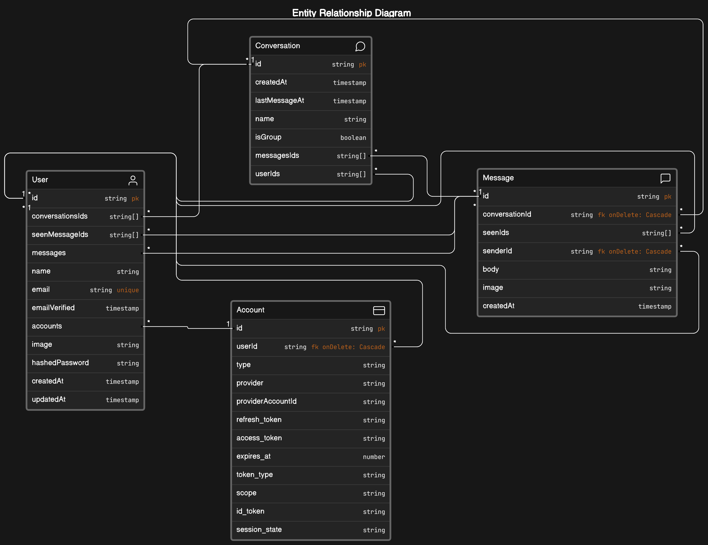

# Messenger Clone

## 💻 Kits & Technologies
1. Framework：Next.js app router
2. UI：Tailwind + headlessui
3. Database & ORM：prisma + mongodb
4. Hashed password：bcrypt
5. Form：react-hook-form
6. Third-Party Login：NextAuth
7. Upload Image：next-cloudinary
8. Realtime Conversation: Pusher

## 📂 File Structure

## 👨‍👦 User Flow

## 📦 Data Models


## ✏️ Note

### Next 載入其它網域的圖片
如果要讓 Next 載入其他網域的圖片，需要到 `next.config.js` 配置，如下
```js
const nextConfig = {
  images: {
    domains: [
      'res.cloudinary.com', // 指定 Cloudinary 網域的圖片可以被載入和顯示
      'avatars.githubusercontent.com', // 指定 GitHub 使用者頭像的網域的圖片可以被載入和顯示
      'lh3.googleusercontent.com', // 指定 Google 使用者頭像的網域的圖片可以被載入和顯示
    ],
  },
};

module.exports = nextConfig;
```
❗ 注意，Next 14 已經改用 remotePattern

```js
const nextConfig = {
  images: {
    remotePatterns: [
      {
        protocol: 'https',
        hostname: 'res.cloudinary.com',
        port: '',
      },
      {
        protocol: 'https',
        hostname: 'avatars.githubusercontent.com',
        port: '',
      },
      {
        protocol: 'https',
        hostname: 'lh3.googleusercontent.com',
        port: '',
      }
    ],
  },
};

module.exports = nextConfig;

```

### HTTP Code
1. 資訊回應 (Informational responses, 100–199)
2. 成功回應 (Successful responses, 200–299)
   1. 200 OK 請求成功。
3. 重定向 (Redirects, 300–399)
4. 用戶端錯誤 (Client errors, 400–499)
    1. 400 Bad Request 此回應意味伺服器因為收到**無效語法**，而無法理解請求。
    2. 401 Unauthorized 需要授權以回應請求。它有點像 403，但這裡的授權，是有可能辦到的。
    3. 403 Forbidden 用戶端並無訪問權限，例如未被授權，所以伺服器拒絕給予應有的回應。不同於 401，**伺服端知道用戶端的身份。**
    4. 404 Not Found 伺服器找不到請求的資源。
5. 伺服器端錯誤 (Server errors, 500–599)
   1. 500 Internal Server Error 伺服器端發生未知或無法處理的錯誤。
   2. 504 Gateway Timeout 伺服器作為閘道器時無法及時得到回應。

### 分別控制 List child 的樣式
可以利用表驅動法 (Table-Driven Approach) 來針對多個元素的樣式

```ts
// app\components\AvatarGroup.tsx`
const AvatarGroup = ({ users = [] }) => {

  // ... 

  // Here 👇
  const positionMap = {
    0: 'top-0 left-[12px]',
    1: 'bottom-0',
    2: 'bottom-0 right-0',
  };

  return (
    // ... 
      {slicedUsers.map((user, index) => (
        <div
          key={user.id}
          className={`absolute inline-block rounded-full overflow-hidden h-[21px] w-[21px] ${
            positionMap[index as keyof typeof positionMap] // Here 👈
          }`}
        >
          // ...
        </div>
      ))}
  );
};

export default AvatarGroup;

```

### 使用 headless ui 的 Dialog 來製作 Modal
透過 Transition 和 Dialog 可以封裝自己的 Modal。

```tsx
// app\components\Modal.tsx
'use client';

// Components
import { Fragment } from 'react';
import { Dialog, Transition } from '@headlessui/react';
import { IoClose } from 'react-icons/io5';

const Modal: React.FC<ModalProps> = ({ isOpen, onClose, children }) => {
  return (
    <Transition.Root show={isOpen} as={Fragment}>
      <Dialog as="div" className="relative z-50" onClose={onClose}>
        {/* Background overlay */}
        <Transition.Child
          as={Fragment}
          enter="ease-out duration-300"
          enterFrom="opacity-0"
          enterTo="opacity-100"
          leave="ease-in duration-200"
          leaveFrom="opacity-100"
          leaveTo="opacity-0"
        >
          <div className="fixed inset-0 bg-gray-500 bg-opacity-75 transition-opacity"></div>
        </Transition.Child>
        {/* Modal container */}
        <Transition.Child
          as={Fragment}
          enter="ease-out duration-300"
          enterFrom="opacity-0 translate-y-4 sm:translate-y-0 sm:scale-95"
          enterTo="opacity-100 translate-y-0 sm:scale-100"
          leave="ease-in duration-200"
          leaveFrom="opacity-100 translate-y-0 sm:scale-100"
          leaveTo="opacity-0 translate-y-4 sm:translate-y-0 sm:scale-95"
        >
          <div className="fixed inset-0 z-10 overflow-y-auto min-h-full flex items-center justify-center p-4 text-center sm:p-0">
            <Dialog.Panel className="relative transform overflow-hidden rounded-lg bg-white px-4 pb-4 text-left shadow-xl transition-all w-full sm:my-8 sm:w-full sm:max-w-lg sm:p-6">
              {/* Close button */}
              <div className="absolute right-0 top-0 hidden pr-4 pt-4 sm:block z-10">
                <button
                  type="button"
                  className="rounded-md text-gray-400 hover:text-gray-500 focus:outline-none focus:ring-2 focus:ring-sky-500 focus:ring-offset-2"
                  onClick={onClose}
                >
                  <span className="sr-only">Close</span>
                  <IoClose className="h-6 w-6"></IoClose>
                </button>
              </div>
              {/* Modal content */}
              {children}
            </Dialog.Panel>
          </div>
        </Transition.Child>
      </Dialog>
    </Transition.Root>
  );
};

export default Modal;

```

接著可以在需要的地方補充更多功能，例如 ImageModal

```tsx
// Components
import Modal from '@/app/components/Modal';
import Image from 'next/image';

export const ImageModal: React.FC<ImageModalProps> = ({
  isOpen,
  onClose,
  src,
}) => {
  if (!src) {
    return null;
  }

  return (
    <Modal isOpen={isOpen} onClose={onClose}>
      <div className="w-80 h-80">
        <Image
          alt="Image"
          fill
          src={src}
          className="object-cover"
        />
      </div>
    </Modal>
  );
};

```
此時可以需要用 Modal 的旁邊引入 ImageModal，而不是在組件的最上層，這樣利於維護。

```tsx
// app\conversations\[conversationId]\components\MessageBox.tsx
const MessageBox: React.FC<MessageBoxProps> = ({ data, isLast }) => {

  // ...

  return (

    // ... 
    // Here 👇
    <ImageModal
      src={data.image}
      isOpen={imageModalOpen}
      onClose={() => setImageModalOpen(false)}
    />
    {data.image ? (
      <Image
        onClick={() => setImageModalOpen(true)}
        alt="Image"
        height={288}
        width={288}
        src={data.image}
        className="object-cover cursor-pointer hover:scale-110 transition translate"
      />
    ) : (
      <div>{data.body}</div>
    )}

  // ...

  );
};

export default MessageBox;

```

### Pusher

在 Server 端，這裡是 node.js，使用 pusher 在一個 channels(渠道)來發布 event(事件)

```js
import {pusherServer} from 'pusher'

pusher.trigger('my-channel', 'my-event', data, socketId).catch((error) => {
  console.log(error);
});
```
接著在 Client 端使用 pusher-js 來訂閱並綁定事件

```js
import {pusherClient} from 'pusher-js'

pusherClient.subscribe('my-channel');

// ...

pusherClient.bind('my-event', fallback)
```

### NextAuth
在 `app/api/auth/[...nextauth]/route.ts` 裡設定 NextAuth。

如果你除了第三方登陸以外，還希望用戶可以建立帳號在你的資料庫，並執行登陸的話，可以用 CredentialsProvider

```ts
import bcrypt from 'bcrypt';
import NextAuth, { AuthOptions } from 'next-auth';
import CredentialsProvider from 'next-auth/providers/credentials';
import GithubProvider from 'next-auth/providers/github';
import GoogleProvider from 'next-auth/providers/google';
import { PrismaAdapter } from '@next-auth/prisma-adapter';

import prisma from '@/app/libs/prismadb';

export const authOptions: AuthOptions = {
  adapter: PrismaAdapter(prisma),
  providers: [
    GithubProvider({
      clientId: process.env.GITHUB_ID as string,
      clientSecret: process.env.GITHUB_SECRET as string,
    }),
    GoogleProvider({
      clientId: process.env.GOOGLE_ID as string,
      clientSecret: process.env.GOOGLE_SECRET as string,
    }),
    CredentialsProvider({
      name: 'credentials',
      credentials: {
        email: { label: 'email', type: 'text' },
        password: { label: 'password', type: 'password' },
      },
      async authorize(credentials) {
        // 這裡放認證的流程
        if (!credentials?.email || !credentials?.password) {
          throw new Error('Invalid Credentials');
        }

        const user = await prisma.user.findUnique({
          where: {
            email: credentials.email,
          },
        });

        if (!user || !user.hashedPassword) {
          throw new Error('Invalid Credentials');
        }

        const isCorrectPassword = await bcrypt.compare(
          credentials.password,
          user.hashedPassword
        );

        if (!isCorrectPassword) {
          throw new Error('Invalid credentials');
        }

        return user;
      },
    }),
  ],
  debug: process.env.NODE_ENV === 'development',
  session: {
    strategy: 'jwt',
  },
  secret: process.env.NEXTAUTH_SECRET,
};

const handler = NextAuth(authOptions);

export { handler as GET, handler as POST };

```

接著就能在登錄頁面處理登陸或註冊的邏輯。

而 NextAuth 很方便，要登入的話直接調用 signIn 即可。也可以用 useSession 來查看用戶的狀態 (但要記得在父組件提供 SessionProvider)

```tsx
import { signIn, useSession } from 'next-auth/react';

// Type
type VariantType = 'LOGIN' | 'REGISTER';

const AuthForm = () => {
  const [variant, setVariant] = useState<VariantType>('LOGIN');
  const [isLoading, setIsLoading] = useState(false);
  const session = useSession();
  const router = useRouter();

  // if user is login, jump to users page
  useEffect(() => {
    if (session?.status === 'authenticated') {
      router.push('/users');
    }
  }, [session?.status]);

  // ...

  // Handle normal credentials log in
  const onSubmit: SubmitHandler<FieldValues> = (data) => {
    setIsLoading(true);

    if (variant === 'REGISTER') {
      axios
        .post('/api/register', data)
        .then(() => signIn('credentials', data))
        .catch(() => toast.error('Something went wrong！'))
        .finally(() => setIsLoading(false));
    }

    if (variant === 'LOGIN') {
      signIn('credentials', {
        ...data,
        redirect: false,
      })
        .then((callback) => {
          if (callback?.error) {
            toast.error('Invalid credentials');
          }

          if (callback?.ok && !callback?.error) {
            toast.success('Logged in!');
            router.push('/users');
          }
        })
        .finally(() => setIsLoading(false));
    }
  };

  // Handle github or google log in
  const socialAction = (action: 'github' | 'google') => {
    setIsLoading(true);

    // NextAuth Social Sign In
    signIn(action, { redirect: false })
      .then((callback) => {
        if (callback?.error) {
          toast.error('Invalid Credentials');
        }

        if (callback?.ok && !callback?.error) {
          toast.success('Logged in!');
          router.push('/users');
        }
      })
      .finally(() => setIsLoading(false));
  };

  return ( 'FORM UI' );
};

export default AuthForm;

```